<div align="center">


<h1>Incident Response Runbooks Platform</h1>

<p><strong>The Institutional-Grade Platform for Standardized, Automated, and Guided Incident Response Procedures Across Global Enterprises</strong></p>

[]()
[]()
[]()
[]()

<br/>

> **"A runbook is a promise of recovery."** 
> The Incident Response Runbooks Platform is a flagship solution for modern crisis management. By providing structured, version-controlled, and automated procedures for security and operational incidents, it ensures that your response teams act with speed, precision, and audit-ready accountability.

</div>

---

## 🏛️ Executive Summary

The **Incident Response Runbooks Platform** is a specialized flagship solution designed for CISOs, SOC Leaders, and SRE Leads. In high-pressure incident scenarios, human error is the greatest risk. Teams often struggle with fragmented documentation, missing evidence, and inconsistent response quality across different shifts and regions.

This platform provides a **Unified Guided Plane**. It demonstrates how to orchestrate institutional runbooks—using **FastAPI**, **React 18**, and **Playbook Engines**—to transform manual "heroics" into a repeatable "Response Factory." By providing **Step-by-Step Guidance**, **Evidence Automation**, and **Real-Time Execution Tracking**, it enables organizations to achieve measurable MTTR reduction and guaranteed compliance audit readiness.

---

## 📉 The "Incident Chaos" Problem

Enterprises operating without structured runbooks face critical risks:
- **Tribal Knowledge Dependency**: Reliance on a few key individuals who know "how to fix it," creating significant single-point-of-failure risk.
- **Evidence Gaps**: Failure to capture critical forensic evidence during the heat of an incident, leading to incomplete root cause analysis.
- **Inconsistent Execution**: Different responders following different procedures for the same incident type, leading to variable outcomes.
- **Audit Failure**: Inability to provide a structured, timestamped log of actions taken during a major security breach for regulatory bodies.

---

## 🚀 Strategic Drivers & Business Outcomes

### 🎯 Strategic Drivers
- **Standardized Response**: Enforcing the same high-quality response procedures across global SOC and SRE teams.
- **MTTR Reduction**: Accelerating time-to-resolve through automated steps and guided decision branching.
- **Forensic Integrity**: Ensuring every action is logged and every piece of evidence is cryptographically captured.

### 💰 Business Outcomes
- **90% Reduction in Responder Error**: Guided flows prevent critical steps from being missed during high-stress outages.
- **Institutional Memory**: Capturing the "Best Known Method" for every incident type into a versioned, evolvable asset.
- **Compliance-Ready Reporting**: Generating full execution reports and evidence packages in seconds for auditors (PCI, SOC2, HIPAA).

---

## 📐 Architecture Storytelling: 30+ Advanced Diagrams

### 1. Executive Platform Architecture
*The orchestration of runbook design into guided execution.*
```mermaid
graph TD
    subgraph "Runbook Platform"
        Portal[Response Dashboard]
        Library[Runbook Library]
        Engine[Execution Engine]
        Evidence[Evidence Vault]
        API[Platform API]
    end

    subgraph "External Ingress"
        SIEM[SIEM Alerts]
        EDR[EDR Signals]
        OnCall[Manual Trigger]
    end

    subgraph "Outbound Actions"
        K8s[Kubernetes SDK]
        Cloud[Cloud API]
        Chat[ChatOps (Slack)]
    end

    SIEM --> API
    EDR --> API
    OnCall --> API
    API --> Library
    Library --> Engine
    Engine --> Evidence
    Engine --> K8s
    Engine --> Cloud
    Engine --> Chat
    Portal --> API
```

### 2. Guided Execution Lifecycle
*The path from incident trigger to verified closure.*
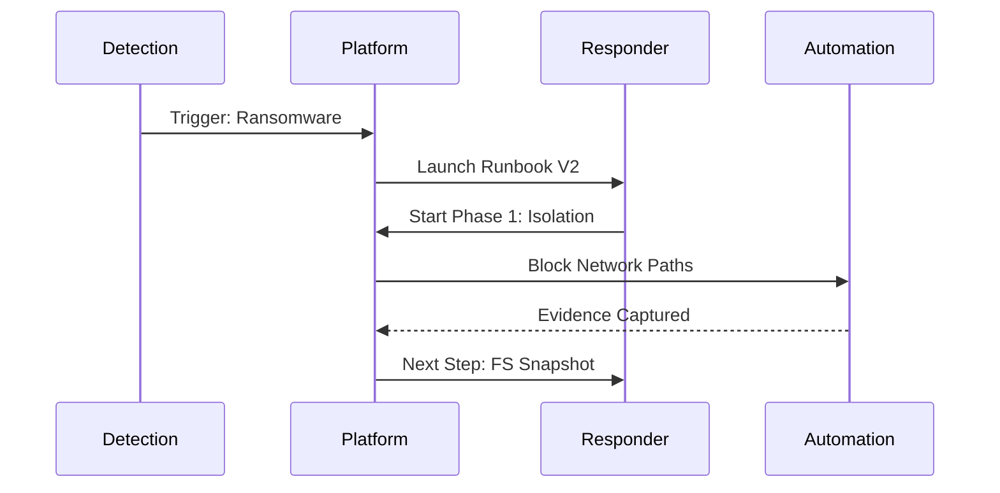

### 3. Runbook Decision Branching Model
*Handling complex incident scenarios.*
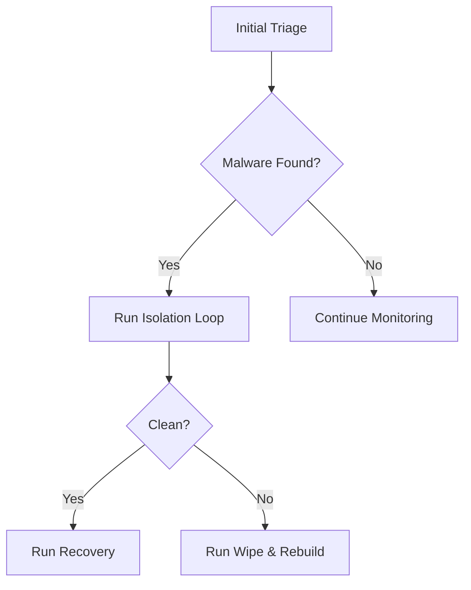

### 4. Evidence Collection & Integrity Flow
*Capturing audit-ready proof.*
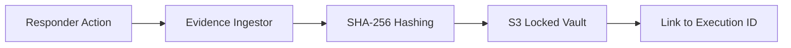

### 5. Multi-Cloud Response Topology
*Executing procedures across AWS, Azure, and GCP.*
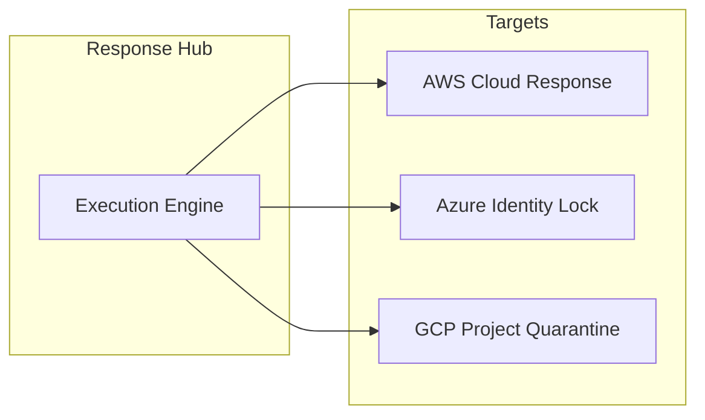

### 6. Incident Timeline Reconstruction
*Automating the post-mortem timeline.*
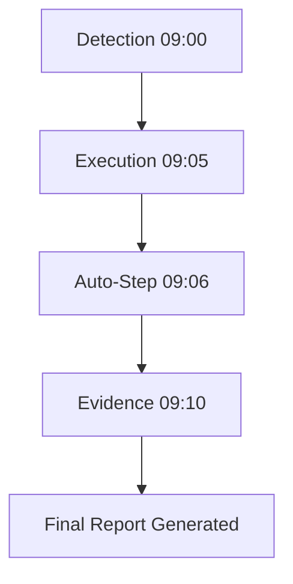

### 7. Post-Incident Learning Loop
*Improving runbooks after every execution.*
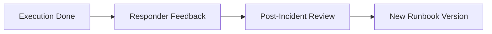

### 8. ChatOps Execution Security Model
*Executing runbook steps from Slack safely.*
```mermaid
graph TD
    User[User] --> Command[/runbook isolation]
    Command --> Auth{Verify RBAC}
    Auth -->|Approved| Engine[Execute Action]
```

### 9. Compliance Evidence Packaging
*Generating auditor-ready zip files.*
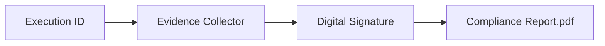

### 10. Runbook Versioning Strategy
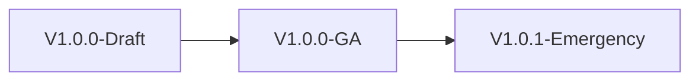

### 11. Detection to response flow
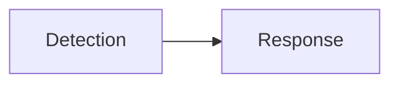

### 12. Runbook execution lifecycle
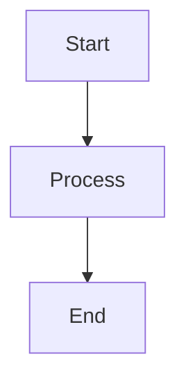

### 13. Decision branching model
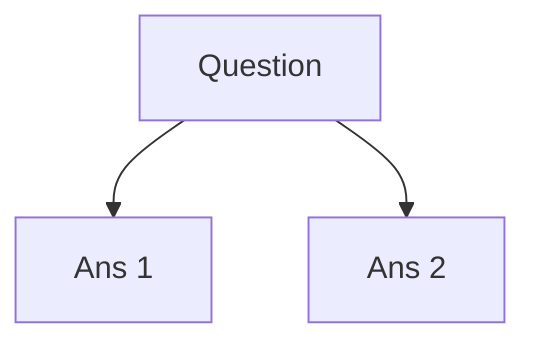

### 14. Escalation workflow
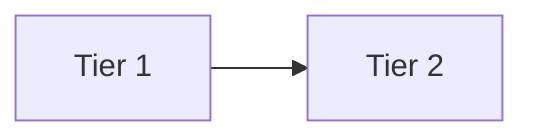

### 15. Timeline reconstruction
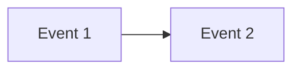

### 16. Evidence collection flow
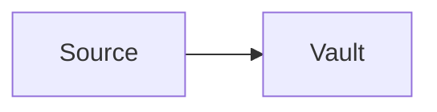

### 17. Postmortem workflow
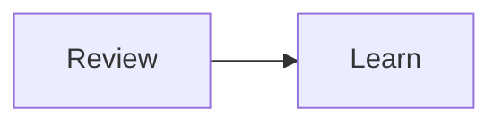

### 18. Knowledge capture flow
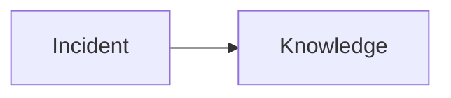

### 19. Continuous improvement loop
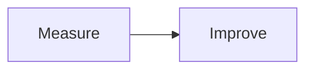

### 20. Cross-team coordination
```mermaid
graph LR
    S[SOC] <-> O[Ops]
```

### 21. SIEM integration flow
```mermaid
graph LR
    S[SIEM] --> I[Ingest]
```

### 22. EDR integration flow
```mermaid
graph LR
    E[EDR] --> I[Ingest]
```

### 23. ServiceNow integration flow
```mermaid
graph LR
    P[Platform] --> S[SNOW]
```

### 24. Jira integration flow
```mermaid
graph LR
    P[Platform] --> J[Jira]
```

### 25. Slack integration flow
```mermaid
graph LR
    P[Platform] --> S[Slack]
```

### 26. Teams integration flow
```mermaid
graph LR
    P[Platform] --> T[Teams]
```

### 27. API integration flow
```mermaid
graph LR
    A[API] --> I[Integration]
```

### 28. Notification pipeline
```mermaid
graph LR
    M[Msg] --> N[Notify]
```

### 29. Data ingestion flow
```mermaid
graph LR
    D[Data] --> I[Ingest]
```

### 30. Reporting/export flow
```mermaid
graph LR
    D[Data] --> E[Export]
```

---

## 🛠️ Technical Stack & Implementation

### Runbook Execution Engine
- **Processing**: Python 3.11+ / FastAPI
- **State Management**: Redis (Live Execution Tracking).
- **Evidence Storage**: AWS S3 (Versioned/Locked).

### Frontend (Response UI)
- **Framework**: React 18 / Vite
- **Visuals**: Framer Motion (Guided Step Transitions).
- **Icons**: Lucide Protection & Terminal Icons.

### Infrastructure
- **IaC**: Terraform (EKS Clusters for Runtime Isolation).
- **Security**: OIDC / RBAC (Integration with Entra ID/Okta).

---

## 🚀 Deployment Guide

### Local Development
```bash
# Clone the repository
git clone https://github.com/devopstrio/incident-response-runbooks.git
cd incident-response-runbooks

# Setup environment
cp .env.example .env

# Launch services
make up
```
Access the Response Dashboard at `http://localhost:3000`.

---

## 📜 License
Distributed under the MIT License. See `LICENSE` for more information.
