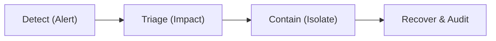
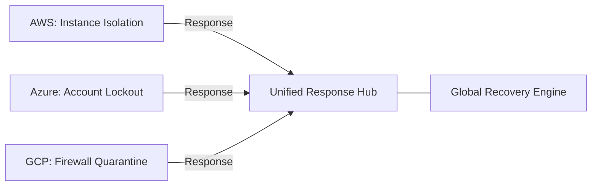
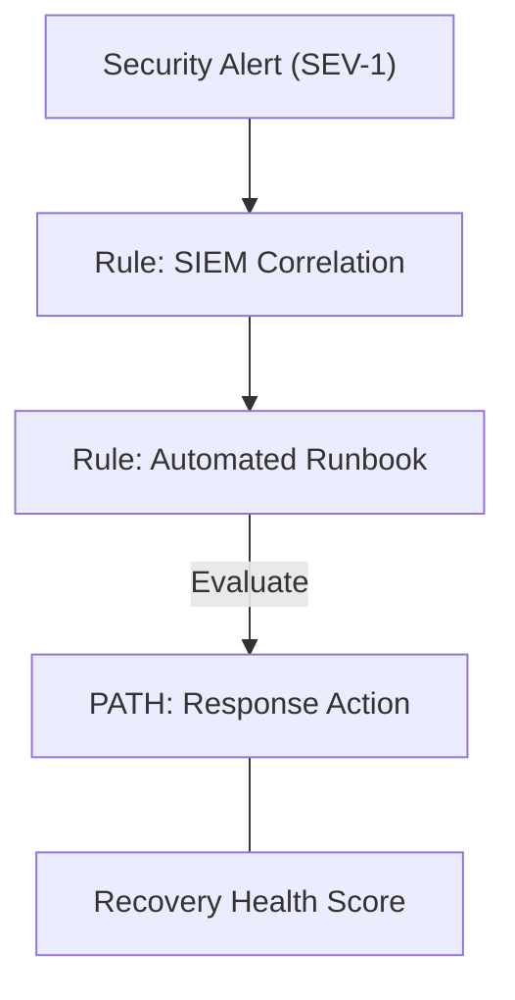
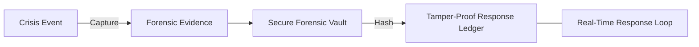
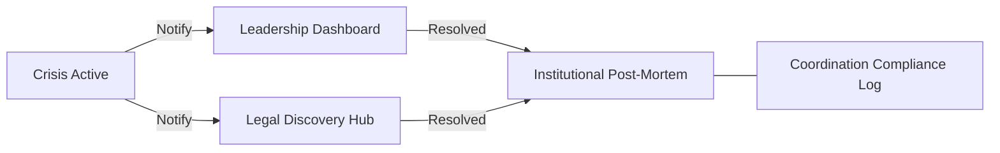
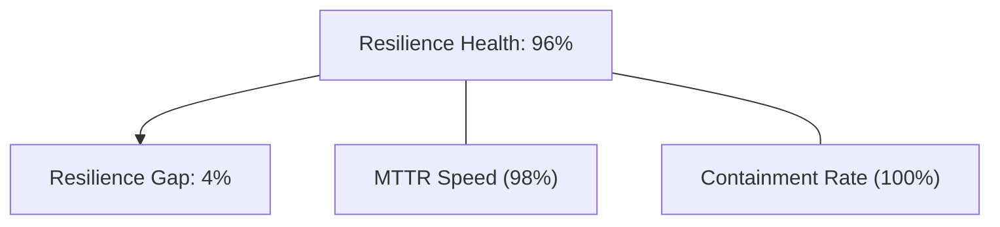
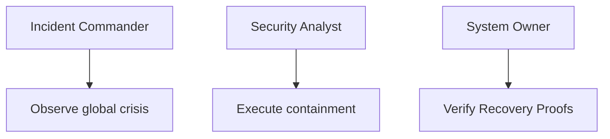
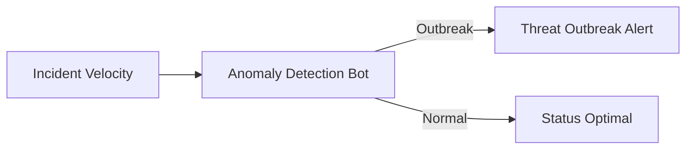

<div align="center">


<h1>Incident Response Runbooks</h1>

<p><strong>The Institutional-Grade Platform for Standardized, Automated, and Guided Incident Response Procedures Across Global Enterprises.</strong></p>

[]()
[]()
[]()

<br/>

> **"A runbook is a promise of recovery."** 
> **Incident Response Runbooks** is an enterprise-grade platform designed to provide a secure, measurable, and highly automated foundation for global crisis operations. It orchestrates the complex lifecycle of incident response—from automated threat detection and multi-cloud isolation to distributed evidence vaulting and unified stakeholder coordination.

</div>

---

## 🏛️ Executive Summary

Fragmented response procedures and manual coordination processes are strategic resilience liabilities; lack of centralized incident orchestration is a primary barrier to organizational crisis agility. Organizations fail to maintain operational continuity not because of a lack of skill, but because of fragmented response standards, lack of automated containment validation, and an inability to orchestrate incident landing zones with operational precision.

This platform provides the **Resilience Intelligence Plane**. It implements a complete **Enterprise Response-as-Code Framework**, enabling SOC and SRE teams to manage global crisis efforts as first-class citizens. By automating the identification of threat outbreaks through real-time alert analysis and orchestrating the vaulting of forensic evidence, we ensure that every organizational incident—from critical security breaches to routine system outages—is responded to by default, audited for history, and strictly aligned with institutional resilience frameworks.

---

## 📐 Architecture Storytelling: Principal Reference Models

### 1. Principal Architecture: Global Incident Response & Resilience Intelligence Plane
This diagram illustrates the end-to-end flow from multi-cloud alert ingestion and triage to automated containment, forensic vaulting, and institutional incident auditing.

```mermaid
graph LR
    %% Subgraph Definitions
    subgraph AlertIngress["Multi-Cloud & Alert Ingress"]
        direction TB
        SIEM_EDR_Alerts["SIEM / EDR Security Alerts"]
        ObservabilityAlerts["SRE / APM System Alerts"]
        ManualReports["Manual Emergency Reports"]
    end

    subgraph IntelligenceEngine["Resilience Intelligence Hub"]
        direction TB
        API["FastAPI Response Gateway"]
        TriageEngine["Severity & Impact Triager"]
        ContainmentOrch["Containment & Isolation Orch"]
        ForensicVault["Forensic Evidence Vault"]
    end

    subgraph EnforcementPlane["Distributed Response Fleet"]
        direction TB
        ResponseWorkers["Automated Runbook Executors"]
        EvidenceCollectors["Forensic Data Gatherers"]
        ResponseProxies["Crisis Coordination Proxies"]
    end

    subgraph OperationsHub["Institutional Response Hub"]
        direction TB
        Scorecard["Resilience Maturity Score"]
        Analytics["MTTR & MTTC Recovery Stats"]
        Audit["Forensic Incident Metadata Lake"]
    end

    subgraph DevOps["Response-as-Code Framework"]
        direction TB
        TF["Terraform Response Modules"]
        ThreatBot["Threat Outbreak Validator"]
        ChatOps["Response Approval Hub"]
    end

    %% Flow Arrows
    AlertIngress -->|1. Submit Alert| API
    API -->|2. Triage Severity| TriageEngine
    TriageEngine -->|3. Identify Containment| ContainmentOrch
    ContainmentOrch -->|4. Vault Evidence| ForensicVault
    
    ContainmentOrch -->|5. Execute Containment| EnforcementPlane
    EnforcementPlane -->|6. Notify Incident| ChatOps
    API -->|7. Visualize Recovery| Scorecard
    
    Scorecard -->|8. Track MTTR| Analytics
    Scorecard -->|9. Record Finding| Audit
    
    TF -->|10. Provision Hub| IntelligenceEngine
    ThreatBot -->|11. Inject Outbreak Risk| TriageEngine
    Audit -->|12. Improve Runbook| ContainmentOrch

    %% Styling
    classDef ingress fill:#f5f5f5,stroke:#616161,stroke-width:2px;
    classDef intel fill:#e8eaf6,stroke:#1a237e,stroke-width:2px;
    classDef enforcement fill:#e1f5fe,stroke:#01579b,stroke-width:2px;
    classDef ops fill:#ede7f6,stroke:#311b92,stroke-width:2px;
    classDef devops fill:#e8f5e9,stroke:#1b5e20,stroke-width:2px;

    class AlertIngress ingress;
    class IntelligenceEngine intel;
    class EnforcementPlane enforcement;
    class OperationsHub ops;
    class DevOps devops;
```



### 2. The Incident Response Lifecycle Flow
The continuous path of an incident from initial detection (alert) and triage to active containment (isolation), eradication, recovery, and institutional forensic auditing.



### 3. Distributed Automated Response Topology
Strategically orchestrating response actions across AWS, Azure, GCP, and on-premises environments, providing a unified institutional view of global incident containment and system health.



### 4. Security Orchestration & Automation (SOAR) Flow
Executing complex logic for integrating SIEM alerts with automated runbook execution, ensuring every high-severity alert is contained by default through pre-approved response policies.



### 5. Evidence Preservation & Forensic Imaging Flow
Securely capturing and vaulting critical forensic proof—including disk images and memory dumps—in an air-gapped forensic vault for institutional record-keeping.



### 6. Communication & Stakeholder Coordination Flow
Managing the lifecycle of a crisis communication plan, handling automated notifications to leadership, legal, and PR teams to ensure institutional alignment during an active crisis.



### 7. Institutional Resilience Maturity Scorecard
Grading organizational performance based on key indicators: MTTR (Response), MTTC (Containment), and Runbook Coverage Index.



### 8. Identity & RBAC for Incident Governance
Managing fine-grained access to runbook libraries, containment triggers, and audit logs between Incident Commanders, Security Analysts, and System Owners.



### 9. IaC Deployment: Response-as-Code Framework
Using modular Terraform to deploy and manage the versioned distribution of the response tracking hubs, automation workers, and forensic metadata lakes.


### 10. AIOps Threat Anomaly & Outbreak Validation Flow
Using advanced analytics to identify sudden surges in organizational incidents, suspicious lateral movement patterns, or unusual outbreak velocities that could result in institutional risk.



### 11. Metadata Lake for Forensic Incident Audit
Storing long-term records of every alert received, every response action executed, and every post-mortem finding for institutional record-keeping, compliance auditing, and post-incident forensics.


---

## 🏛️ Core Resilience Pillars

1.  **Unified Response Coordination**: Maximizing agility by centralizing all crisis monitoring through a single institutional plane.
2.  **Automated Forensic Vaulting**: Eliminating "missing evidence" scenarios through proactive and immutable data preservation.
3.  **Sequential Containment Intelligence**: Ensuring zero-interruption operations through dependency-aware multi-cloud isolation.
4.  **Zero-Trust Response Protection**: Automatically enforcing least-privilege triggers and rule evaluation across all response tiers.
5.  **Autonomous Recovery Logic**: Guaranteeing availability through automated industry-specific restoration runbooks.
6.  **Full Incident Auditability**: Immutable recording of every response action and post-mortem finding for institutional forensics.

---

## 🛠️ Technical Stack & Implementation

### Response Engine & APIs
*   **Framework**: Python 3.11+ / FastAPI.
*   **SOAR Engine**: Integration with SIEM (Splunk/Sentinel) and EDR (CrowdStrike/Defender) APIs.
*   **Containment Hub**: Custom Python-based logic for multi-cloud instance and network isolation.
*   **Persistence**: PostgreSQL (Incident Ledger) and Redis (Live Job State).
*   **Auth Orchestrator**: Federated OIDC/SAML for least-privilege response management access.

### Response Dashboard (UI)
*   **Framework**: React 18 / Vite.
*   **Theme**: Dark, Blue, Slate (Modern high-fidelity resilience aesthetic).
*   **Visualization**: D3.js for incident topologies and Recharts for MTTR velocity analytics.

### Infrastructure & DevOps
*   **Runtime**: AWS EKS or Azure Kubernetes Service (AKS) for management plane.
*   **Forensic Hub**: Air-gapped and replicated S3/Blob storage with WORM policies.
*   **IaC**: Modular Terraform for deploying the response landing zone and validation fleet.

---

## 🏗️ IaC Mapping (Module Structure)

| Module | Purpose | Real Services |
| :--- | :--- | :--- |
| **`infrastructure/res_hub`** | Central management plane | EKS, PostgreSQL, Redis |
| **`infrastructure/workers`** | Distributed response fleet | K8s Workers, Cloud APIs |
| **`infrastructure/forensics`** | Immutable evidence storage sinks | S3, Object Lock, IAM |
| **`infrastructure/auditing`** | Forensic incident sinks | S3, Athena, Quicksight |

---

## 🚀 Deployment Guide

### Local Principal Environment
```bash
# Clone the response platform
git clone https://github.com/devopstrio/incident-response-runbooks.git
cd incident-response-runbooks

# Configure environment
cp .env.example .env

# Launch the Response stack
make init

# Trigger a mock alert ingestion and automated containment simulation
make simulate-response
```

Access the Response Dashboard at `http://localhost:3000`.

---

## 📜 License
Distributed under the MIT License. See `LICENSE` for more information.

---
<div align="center">
  <p>© 2026 Devopstrio. All rights reserved.</p>
</div>
