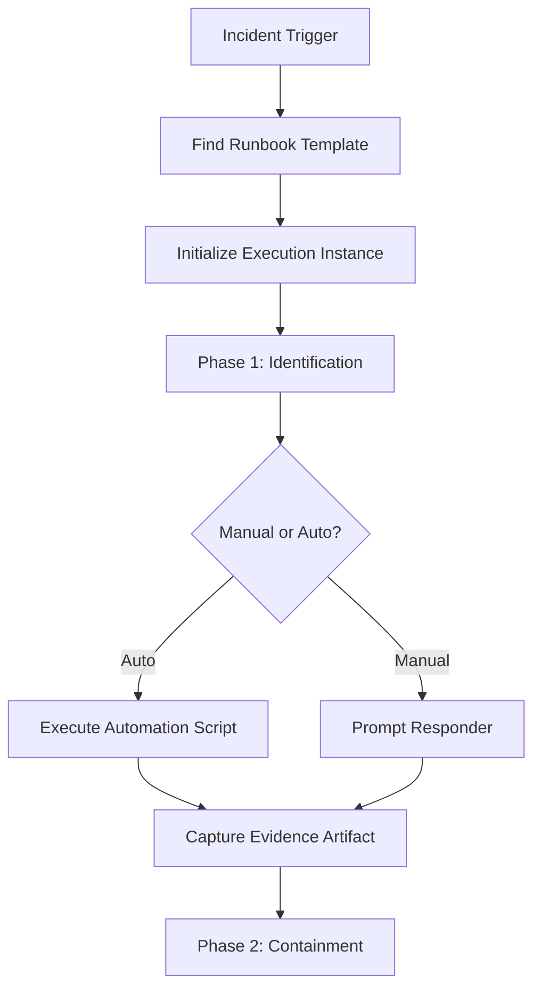
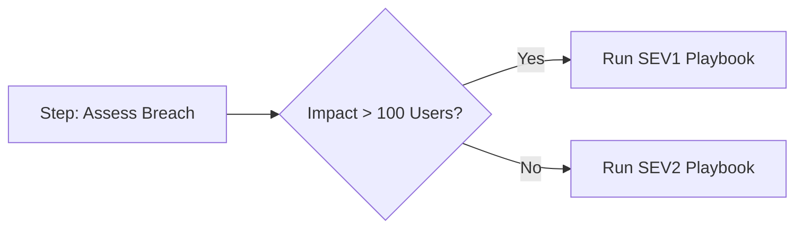
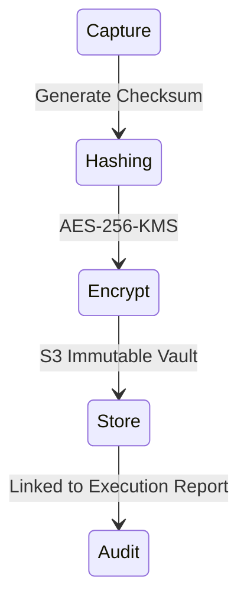

# Architecture & Execution Diagrams

## 11. Guided Execution Framework (Detailed)
*How the engine handles step transitions and state persistence.*

## 13. Decision Branching Logic

## 20. Evidence Integrity Chain

