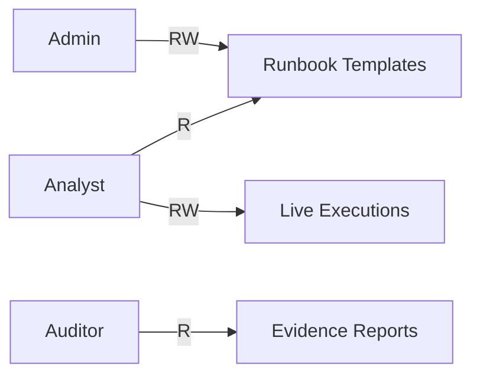
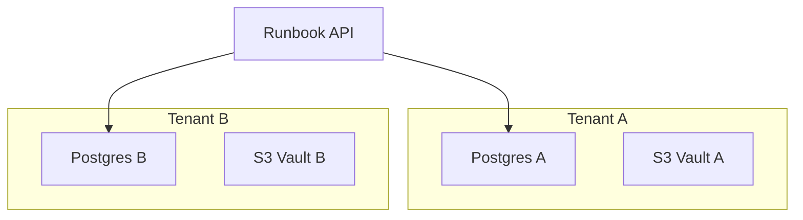
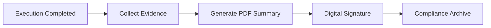

# Security & Compliance Diagrams

## 31. RBAC & Access Control Model

```mermaid
graph LR
    Admin[Admin] -->|RW| Templates[Runbook Templates]
    Analyst[Analyst] -->|R| Templates
    Analyst -->|RW| Executions[Live Executions]
    Auditor[Auditor] -->|R| Reports[Evidence Reports]
```

## 34. Multi-Tenant Isolation Architecture

```mermaid
graph TD
    subgraph "Tenant A"
        DBA[Postgres A]
        VA[S3 Vault A]
    end
    subgraph "Tenant B"
        DBB[Postgres B]
        VB[S3 Vault B]
    end
    API[Runbook API] --> DBA & DBB
```

## 40. Compliance Reporting Workflow

```mermaid
graph LR
    Done[Execution Completed] --> Collect[Collect Evidence]
    Collect --> PDF[Generate PDF Summary]
    PDF --> Sign[Digital Signature]
    Sign --> Archive[Compliance Archive]
```
